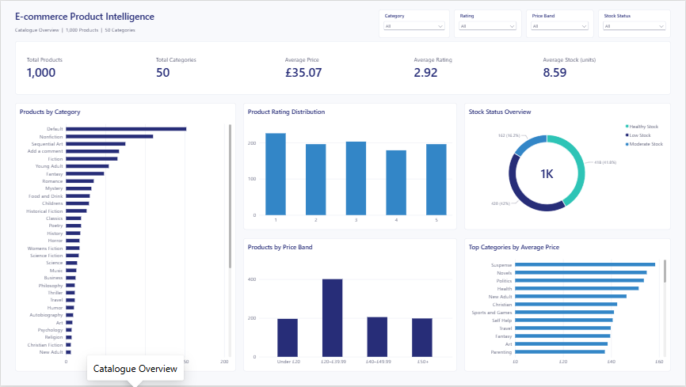
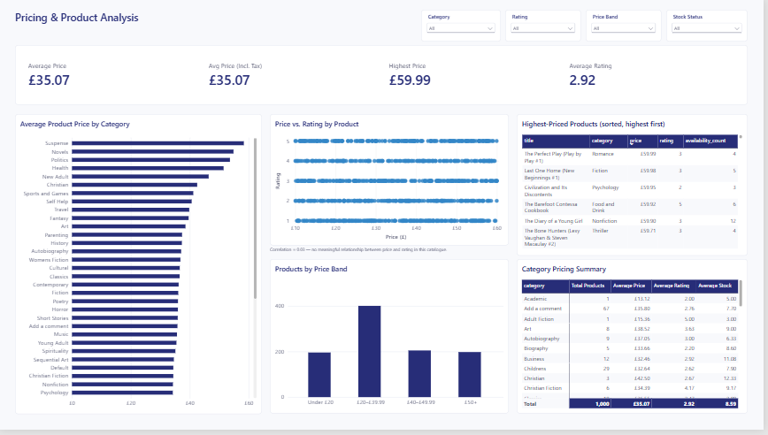
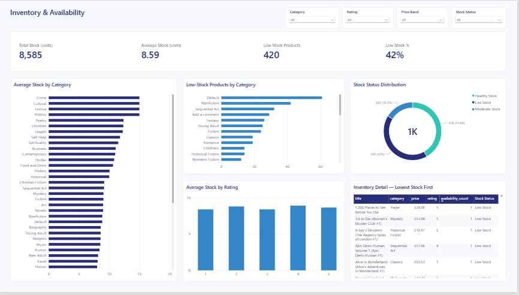

# E-commerce Web Scraper & ETL Pipeline

An end-to-end **data engineering and analytics pipeline** that extracts e-commerce product data, transforms and validates the dataset, loads it into SQLite, and prepares it for **SQL analysis, exploratory analysis, and Power BI business intelligence reporting**.

### What This Project Demonstrates

- **Web scraping:** Python, Requests, BeautifulSoup, pagination, and product-detail extraction
- **ETL development:** structured Extract → Transform → Load workflow
- **Data transformation:** Pandas, data cleaning, type conversion, validation, and quality checks
- **Data storage:** SQLite database and structured CSV outputs
- **SQL analytics:** business-focused queries for pricing, ratings, inventory, and product analysis
- **Exploratory analysis:** Jupyter Notebook and Python
- **Business intelligence:** Power BI dashboard built from the processed dataset
- **Portfolio-ready engineering:** modular Python scripts, reproducible outputs, Git/GitHub version control

### Project Scale

| Metric | Result |
|---|---:|
| Catalogue pages scraped | 50 |
| Products collected | 1,000 |
| Fields per product | 16 |
| Product categories | 50 |
| Raw data | CSV |
| Processed data | CSV |
| Database | SQLite |
| BI reporting | Power BI |

### Data Source

**Books to Scrape** — a practice e-commerce website designed for web scraping.

[Books to Scrape](https://books.toscrape.com/)

## Project Overview

The pipeline follows a modular **Extract → Transform → Load** architecture:

```text
                 BOOKS TO SCRAPE
                       │
                       ▼
              ┌─────────────────┐
              │     EXTRACT     │
              │                 │
              │ Python          │
              │ Requests        │
              │ BeautifulSoup   │
              │ Pagination      │
              └────────┬────────┘
                       │
                       ▼
                  RAW CSV DATA
                       │
                       ▼
              ┌─────────────────┐
              │    TRANSFORM    │
              │                 │
              │ Pandas          │
              │ Cleaning        │
              │ Type Conversion │
              │ Validation      │
              └────────┬────────┘
                       │
                       ▼
               PROCESSED CSV
                       │
                       ▼
              ┌─────────────────┐
              │      LOAD       │
              │                 │
              │ SQLite          │
              └────────┬────────┘
                       │
                       ▼
                   BOOKS.DB
                       │
          ┌────────────┼────────────┐
          ▼            ▼            ▼
      SQL Analysis  Jupyter      Power BI
                   Analysis      Dashboard
## Key Results & Data Quality

The completed pipeline produced a validated dataset of **1,000 products across 50 catalogue pages and 50 categories**.

| Metric | Result |
|---|---:|
| Catalogue pages scraped | 50 |
| Products extracted | 1,000 |
| Fields per product | 16 |
| Categories | 50 |
| Average price | £35.07 |
| Median price | £35.98 |
| Average rating | 2.92 / 5 |
| Average available stock | 8.59 |
| Low-stock products (≤5) | 420 (42%) |
| Duplicate product URLs | 0 |
| Invalid ratings | 0 |
| Invalid prices | 0 |
| Missing descriptions | 2 |

### Data Quality Checks

The transformation stage validates the dataset for:

- Duplicate products and product URLs
- Missing values
- Invalid price values
- Invalid rating values
- Numeric inventory and review counts
- Correct data types
- Timestamp conversion
- Consistent product records

The final dataset contains **no duplicate product URLs, invalid ratings, or invalid prices**.

The two missing descriptions originate from source product pages where a description was not available. They were retained rather than artificially populated, preserving the source data accurately.

## Data Collected

The scraper collects both catalogue-level and product-detail information:

- Product title
- Price
- Availability
- Rating
- Product URL
- UPC
- Product type
- Price excluding tax
- Price including tax
- Tax
- Availability count
- Number of reviews
- Category
- Product description
- Image URL
- Scrape timestamp

## Tech Stack

| Area | Technologies |
|---|---|
| Web Scraping | Python, Requests, BeautifulSoup, urllib.parse, Regular Expressions |
| Data Processing | Pandas, data cleaning, type conversion, validation |
| Storage | CSV, SQLite |
| Analysis | SQL, Jupyter Notebook, Python |
| Business Intelligence | Microsoft Power BI, DAX |
| Development | Git, GitHub, VS Code |

### Core Python Components

- `requests` for HTTP requests
- `BeautifulSoup` for HTML parsing
- `pandas` for transformation and validation
- `urllib.parse` for URL handling
- `re` for pattern extraction
- `sqlite3` for database loading

## Project Structure

```text
Ecommerce-Web-Scraper-ETL/
│
├── data/
│   ├── raw/
│   ├── processed/
│   └── books.db
│
├── notebooks/
│   └── 01_explore_books.ipynb
│
├── src/
│   ├── __init__.py
│   ├── scraper.py
│   ├── transform.py
│   └── load.py
│
├── sql/
│   └── books_analysis.sql
│
├── dashboard/
│   ├── Ecommerce_Web_Scraper_ETL_Dashboard.pbip
│   ├── Ecommerce_Web_Scraper_ETL_Dashboard.Report/
│   └── Ecommerce_Web_Scraper_ETL_Dashboard.SemanticModel/
│
├── requirements.txt
└── .gitignore
```

> Generated datasets and the SQLite database are excluded from version control through `.gitignore`.

## How the Scraper Works

### 1. Catalogue Extraction

`src/scraper.py` first visits the catalogue and follows the pagination links until all 50 pages have been processed.

For each book, it captures the basic catalogue information and constructs an absolute product URL.

### 2. Product Detail Extraction

The scraper then visits each product page and extracts additional information from the product information table, breadcrumb navigation, description section, and product image.

The scraper is organized into reusable functions:

```python
scrape_catalogue()

scrape_product_details()

create_dataframe()

save_raw_data()
```

This modular structure makes individual stages easier to test and reuse.

## Data Transformation & Validation

The transformation stage uses Pandas to:

* Remove duplicate products
* Strip unnecessary whitespace
* Convert currency strings to numeric values
* Convert rating words such as `Three` into numeric ratings
* Convert inventory and review counts to numeric values
* Convert scrape timestamps to datetime
* Check missing values
* Check duplicate product URLs
* Validate rating ranges
* Validate prices

The cleaned dataset is saved as:

```text
data/processed/books_detailed_clean.csv
```

## Database

The processed dataset is loaded into a SQLite database:

```text
data/books.db
```

with a `books` table containing all 1,000 records and 16 fields.

Example query:

```sql
SELECT
    category,
    COUNT(*) AS book_count,
    ROUND(AVG(price), 2) AS average_price
FROM books
GROUP BY category
ORDER BY book_count DESC;
```

## Analysis

The SQL analysis covers:

1. Dataset overview
2. Category performance
3. Low-stock books
4. Highest-priced books
5. Rating distribution
6. Inventory risk
7. High-value/high-rated books
8. Category inventory comparison
9. Category price comparison
10. Category rating comparison
11. Price-band analysis
12. Stock-band analysis

The Jupyter notebook provides additional exploratory analysis, including distributions, data-quality checks, category analysis, and relationships between price, rating, and inventory.

## Power BI Dashboard

The processed e-commerce dataset is also used to build an interactive **E-commerce Product Intelligence Dashboard in Microsoft Power BI**.

The dashboard connects to:

```text
data/processed/books_detailed_clean.csv
```

and transforms the scraped catalogue data into an interactive business intelligence layer.

### Dashboard Pages

#### Catalogue Overview

* Total products
* Average price
* Average rating
* Average available stock
* Products by category
* Price distribution
* Rating distribution
* Stock status
* Category-level pricing analysis

#### Pricing & Product Analysis

* Average price by category
* Price distribution by product
* Price vs. rating analysis
* Price bands
* Highest-priced products
* Category pricing comparison

#### Inventory & Availability

* Total stock
* Average stock
* Low-stock products
* Low-stock percentage
* Stock by category
* Low-stock products by category
* Stock status distribution
* Rating vs. average stock
* Inventory detail table

### Key Dashboard Metrics

| Metric             |    Value |
| ------------------ | -------: |
| Total Products     |    1,000 |
| Categories         |       50 |
| Average Price      |   £35.07 |
| Average Rating     | 2.92 / 5 |
| Average Stock      |     8.59 |
| Low-Stock Products |      420 |
| Low-Stock Rate     |      42% |
| Maximum Price      |   £59.99 |

The dashboard demonstrates how scraped web data can move beyond extraction and storage into **interactive product, pricing, and inventory analysis**.

### Dashboard Preview

The three Power BI pages provide an interactive view of the scraped product catalogue across catalogue performance, pricing, and inventory availability.

#### Catalogue Overview



#### Pricing & Product Analysis



#### Inventory & Availability



### Power BI Project

The Power BI report is stored as a `.pbip` project so that the dashboard structure and semantic model can be version-controlled alongside the ETL pipeline.

```text
dashboard/
├── Ecommerce_Web_Scraper_ETL_Dashboard.pbip
├── Ecommerce_Web_Scraper_ETL_Dashboard.Report/
└── Ecommerce_Web_Scraper_ETL_Dashboard.SemanticModel/
```

Open the `.pbip` file in **Power BI Desktop** to explore the report.

## Example Insights

The completed dataset provides several useful analytical observations:

### Inventory

- **420 products (42%) have 5 or fewer units available**, providing a simple inventory-risk indicator that can be explored by category and stock status.

### Pricing

- The **average listed price is £35.07**, while the **median price is £35.98**.
- The relatively close mean and median indicate that the overall price distribution is not being heavily shifted by a small number of extreme prices.
- The highest listed price in the dataset is **£59.99**.

### Ratings

- The **average product rating is 2.92 / 5**, providing a baseline for comparing product ratings across categories and price bands.

### Price & Rating Relationship

- Price and rating show a **very weak linear relationship**, with a Pearson correlation of approximately **0.03**.
- Within this dataset, higher-priced books therefore do not show a meaningful linear association with higher ratings.

### Catalogue Structure

- The catalogue contains **1,000 products across 50 categories**, allowing pricing, ratings, and inventory levels to be compared at category level.

> **Note:** Books to Scrape is a practice website created for web-scraping exercises. These findings demonstrate the analytical workflow and should not be interpreted as conclusions about the broader publishing market.

## Running the Project

### 1. Clone the Repository

```bash
git clone https://github.com/PatienceAnono/Ecommerce-Web-Scraper-ETL.git

cd Ecommerce-Web-Scraper-ETL
```

### 2. Create and Activate a Virtual Environment

On Windows:

```bash
python -m venv venv

source venv/Scripts/activate
```

### 3. Install Dependencies

```bash
pip install -r requirements.txt
```

### 4. Run the Scraper

```bash
python src/scraper.py
```

This extracts the catalogue and product-detail data and saves the raw dataset under `data/raw/`.

### 5. Run the Transformation

```bash
python src/transform.py
```

This cleans, transforms, validates, and saves the processed dataset under `data/processed/`.

### 6. Load the Database

```bash
python src/load.py
```

This loads the processed dataset into SQLite and verifies the `books` table.

### 7. Explore the Analysis

Open:

```text
notebooks/01_explore_books.ipynb
```

and review:

```text
sql/books_analysis.sql
```

### 8. Explore the Power BI Dashboard

Open the Power BI project in **Power BI Desktop**:

```text
dashboard/Ecommerce_Web_Scraper_ETL_Dashboard.pbip
```

The dashboard uses the processed dataset:

```text
data/processed/books_detailed_clean.csv
```

## Learning Objectives

This project was built to demonstrate practical skills in:

* Web scraping
* HTML parsing
* Pagination handling
* Data extraction from detail pages
* Data cleaning
* Data validation
* ETL workflow design
* CSV data handling
* SQLite database loading
* SQL analysis
* Exploratory data analysis
* Power BI dashboard development
* DAX
* Python project organization
* Git and GitHub workflow

## Portfolio Relevance

This project demonstrates the ability to take **raw, unstructured web data and turn it into a reliable analytical dataset and business intelligence asset**.

The complete workflow is:

**Web Scraping → Data Cleaning → Validation → ETL → SQLite → SQL Analysis → Exploratory Analysis → Power BI**

From a data analytics perspective, the project demonstrates:

- **Data acquisition** — extracting structured information from web pages and handling multi-page catalogues
- **Data preparation** — cleaning, transforming, validating, and standardizing raw data
- **Data quality** — identifying missing values, duplicates, invalid values, and data-type issues
- **Data engineering fundamentals** — separating extraction, transformation, and loading into modular Python components
- **Database skills** — loading structured data into SQLite for persistent querying
- **SQL analysis** — translating a raw dataset into analytical questions around pricing, inventory, ratings, and categories
- **Business intelligence** — presenting analytical findings through an interactive Power BI dashboard
- **Reproducibility** — organizing code, data outputs, analysis, and dashboard assets in a version-controlled GitHub repository

The project complements my broader analytics portfolio across:

- E-commerce performance
- Marketing analytics
- Customer intelligence
- Revenue analysis
- Business intelligence and reporting

Together, these projects demonstrate a broader workflow from **data collection and preparation through analysis, visualization, and business insight**.

## Future Enhancements

Potential future improvements include:

* Automated scheduled scraping
* Incremental data collection
* Logging and error monitoring
* Retry handling for failed requests
* Database indexing
* Automated tests
* Pipeline orchestration

These enhancements are intentionally outside the current scope so the core scraping, ETL, and analytics workflow remains clear and easy to understand.

## Author

**Patience Anono**

Data Analyst | Marketing Analytics & Customer Intelligence

* LinkedIn: 

  https://www.linkedin.com/in/patience-anono-22ab06176/
* Portfolio: 

  https://www.padataanalytics.com/
* GitHub: 

  https://github.com/PatienceAnono
